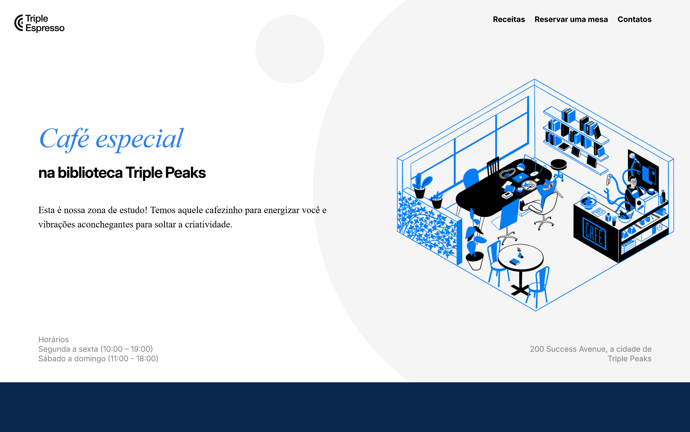
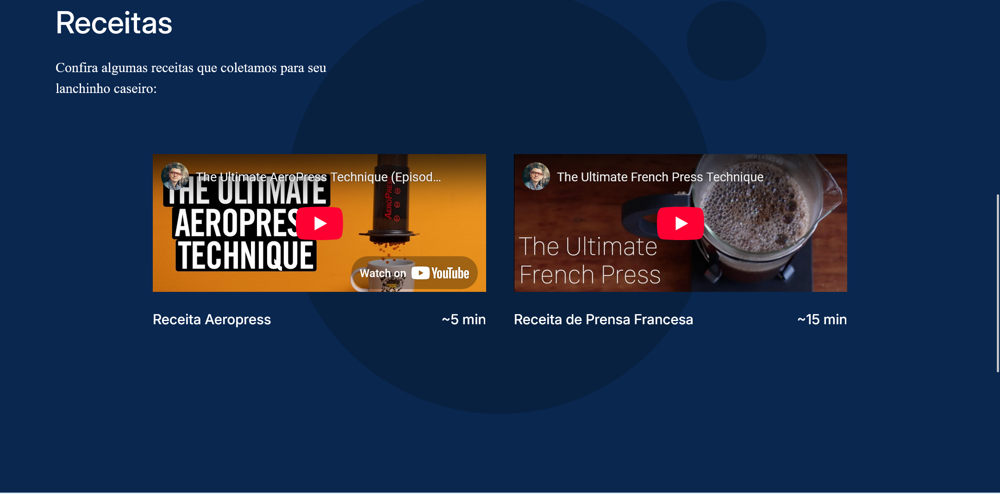
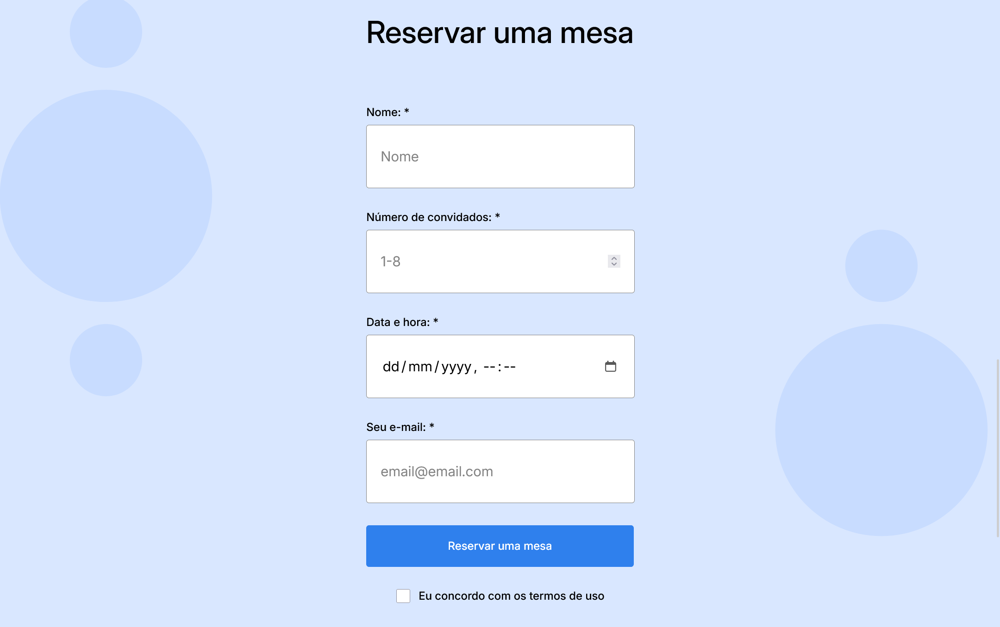
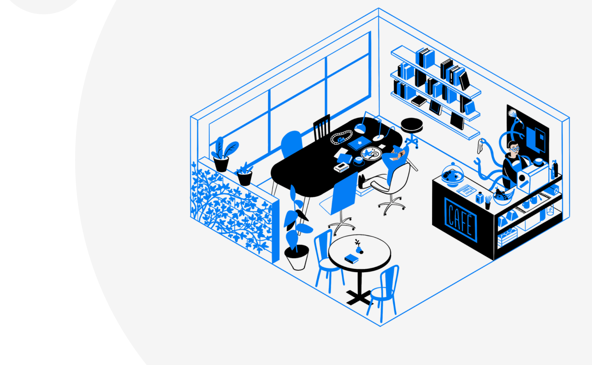

# Triple Espresso

Nome do Projeto

.CoffeeShop - Triple Peaks Library Café

Descrição do Projeto

.Este é um projeto de uma página web responsiva para o café da biblioteca Triple Peaks. O site oferece aos visitantes informações sobre o local, receitas de café, e a possibilidade de reservar uma mesa por meio de um formulário funcional. É um ambiente online voltado a promover um espaço de estudo aconchegante e criativo.

Tecnologias e Técnicas Utilizadas

    .HTML5 semântico

    .CSS com metodologia BEM (Block Element Modifier)

    .Organização modular com arquivos de blocos

    .Fonte importada do Google Fonts

    .Design responsivo

Funcionalidades

    .Navegação com âncoras entre seções

    .Seção de receitas com vídeos incorporados do YouTube

    .Formulário completo para reserva com campos obrigatórios e checkbox de consentimento

    .Layout atrativo com imagens e cores suaves

Imagens do Projeto

.Página Inicial

.Seção de Receitas

.Formulário de Reserva

.Imagens de Fundo e Layout

Melhorias Futuras

.Como ainda sou iniciante em Web Design, tive algumas ideias de coisas que gostaria de aprender e implementar futuramente:

.Criar uma mensagem de confirmação quando a reserva for enviada com sucesso

.Estudar como funciona a criação de um modo escuro (dark mode) para a página

.Aprender a usar Flexbox com mais profundidade para melhorar ainda mais o layout responsivo

.Adicionar animações como efeitos nos botões

.Criar uma versão multilíngue da página, começando com inglês e português
